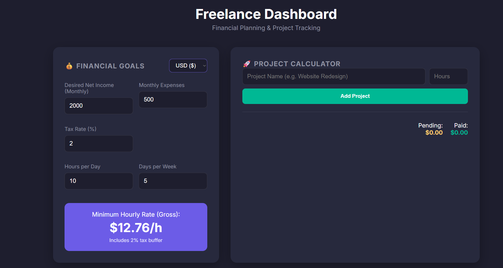

# 🚀 Freelance Dashboard Pro

A comprehensive financial tool designed for freelancers to calculate their ideal hourly rate, track project statuses, and manage monthly revenue targets.

Unlike simple calculators, this dashboard accounts for **Taxes**, **Expenses**, and **Non-billable hours**, ensuring you charge enough to meet your net income goals.




[](https://sherikov.github.io/Freelance-Dashboard/)

## ✨ Key Features

### 💰 Financial Logic
- **Reverse Tax Calculation:** Automatically calculates "Gross" revenue needed to hit your "Net" income target.
- **Hourly Rate Engine:** Dynamically updates your minimum hourly rate based on expenses, desired income, and working hours.
- **Multi-Currency Support:** Switch instantly between **USD ($)**, **EUR (€)**, **RUB (₽)**, **KZT (₸)**, and **GBP (£)**.

### 📊 Project Management
- **Status Tracking:** Mark projects as **Pending** or **Paid**.
- **Revenue Stats:** See exactly how much money is "in the pipeline" versus "in the bank."
- **Reactivity:** Changing your financial goals automatically recalculates the price of all active projects.

### 🛠 Utilities
- **📄 Invoice Mode (Print Styles):** Press `Ctrl + P` (or Cmd + P) to generate a clean, black-and-white invoice list suitable for saving as PDF.
- **💾 Auto-Save:** All data (settings and projects) is persisted in the browser's `LocalStorage`.

## 🧮 The Math Behind It

The dashboard uses the following logic to determine your rate:

1.  **Calculate Net Need:** `Desired Income + Monthly Expenses`
2.  **Calculate Gross Need (Tax Buffer):**
    $$\text{Gross} = \frac{\text{Net Need}}{1 - (\text{Tax Rate} / 100)}$$
3.  **Determine Available Hours:** `Hours/Day × Days/Week × 4 Weeks`
4.  **Final Rate:** `Gross Need / Total Hours`

## 🛠 Tech Stack

- **HTML5:** Semantic markup.
- **CSS3:** CSS Variables, Grid/Flexbox, Dark Mode UI, Print Media Queries.
- **JavaScript (ES6+):**
  - **Reactivity:** DOM manipulation based on state changes.
  - **Intl.NumberFormat:** Native API for accurate currency formatting.
  - **LocalStorage:** For data persistence.

## 📂 Project Structure

```text
freelance-dashboard/
│
├── index.html        # Main application structure
├── css/
│   └── style.css     # Dark theme, layout, and print styles
├── js/
│   └── script.js     # Financial logic and state management
└── README.md         # Documentation
```
🚀 How to Run
Clone the repository:

Bash
```text
git clone [https://github.com/YOUR-USERNAME/freelance-dashboard.git](https://github.com/YOUR-USERNAME/freelance-dashboard.git)
Open the project: Simply double-click index.html to open it in any modern web browser.
```
🖨 How to Export to PDF
To turn your project list into a report/invoice:

Open the dashboard.

Press Ctrl + P (Windows) or Cmd + P (Mac).

The interface will strip away dark colors and input forms.

Choose "Save as PDF" in the print dialog.

🤝 Contributing
Contributions are welcome!

- **Fork the Project**
- **Create your Feature Branch (git checkout -b feature/AmazingFeature)**
- **Commit your Changes (git commit -m 'Add some AmazingFeature')**
- **Push to the Branch (git push origin feature/AmazingFeature)**
- **Open a Pull Request**

📄 License
- Distributed under the MIT License.
